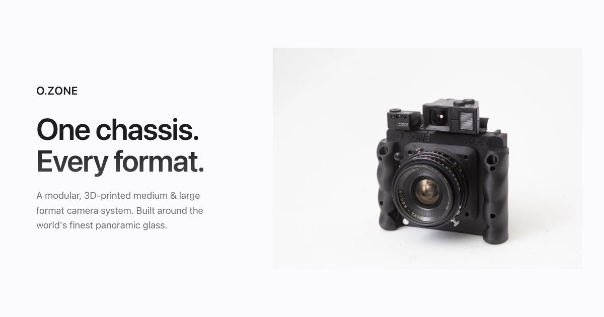

# O.ZONE — Website



Marketing site for the **O.ZONE** modular medium & large format camera system —
a 3D-printed chassis that adapts the world's finest large-format glass to
swappable film backs (6×12, 6×9, 6×7, 4×5 sheet, Instax Wide).

**Live**: [o-zone.xyz](https://o-zone.xyz) — served by GitHub Pages from `main`.
Every push to `main` redeploys automatically within ~1–3 minutes.

## Stack

Vanilla HTML, CSS, JavaScript. No build step, no framework, no dependencies.

To view locally, just **open `index.html` in a browser** — it works straight from
the file system. (For a slightly better dev experience with live reload, you can
run `python3 -m http.server` from the repo root and visit `http://localhost:8000`.)

## Pages

| File              | What it is                                                       |
| ----------------- | ---------------------------------------------------------------- |
| `index.html`      | Landing — hero, why O.ZONE, sample-photo teaser, by-design strip |
| `about.html`      | What the O.ZONE is, why 3D printing, how the layers work, 6×12   |
| `bodies.html`     | SL45 (slim + MP cone), FW69, FW45 (discontinued), Mk.8 / Mk.G    |
| `lenses.html`     | Large format glass (Family one) + Mamiya Press (Family two)      |
| `accessories.html`| Viewfinders, masks, light meters, focus aids, flash, hoods, backs|
| `build.html`      | Build-your-own configurator (Porsche-style)                      |
| `gallery.html`    | Community photo showcase + featured photographer + submit CTA    |

## Repo layout

```
.
├── index.html, about.html, bodies.html, lenses.html,
│   accessories.html, build.html, gallery.html
├── css/
│   └── style.css              # shared design system (all pages)
├── js/
│   ├── main.js                # nav, scroll-reveal, active-link highlight
│   └── build.js               # configurator data + logic (self-contained)
├── SL45 image/                # SL45 body product shots
├── FW45 image/                # FW45 body product shots
├── FW69 image/                # FW69 body product shots
├── MK.8 image/                # Mk.8 body product shots
├── assets/                    # source files (RTF copy, future PSDs)
└── CNAME                      # custom domain — DO NOT DELETE
```

## Editing & deploying

The everyday workflow, one command:

```bash
git pull                                                # before editing
# … make changes …
git add -A && git commit -m "what changed" && git push  # deploys ~1–3 min later
```

If you're working with someone else on the repo, always `git pull` before you
start editing to avoid conflicts.

## Conventions

- **Brand wordmark** in display text is always `O.ZONE` (uppercase, period).
  Folder names and image filenames keep the legacy `O-Zone` form for filesystem
  reasons — don't rename those without updating every HTML reference too.
- **Lens families**: Family one = Large Format (Rodenstock / Nikkor / Schneider).
  Family two = Mamiya Press. Large format comes first throughout the site.
- **Recommended-by-default lenses** are flagged with a green border and a
  `Recommended · NN mm` tag: Nikkor SW 65 / Grandagon-N 75 / Grandagon 90.
  Schneider Super-Angulon 90 variants carry amber "check fit" warnings instead.
- **Image placeholders** are white `<div>` blocks with class `img-placeholder`
  (aspect-ratio set per use). Swap to `` or `background-image: url(...)`
  when real photos arrive — layout will not break.
- **Build configurator** treats body + cone + lens + back + viewfinder + masks
  as the actual build (made by O.ZONE). Light meter / flash / extras are tagged
  as third-party "optional kit" — recommendations only, not part of the order.

## Status

This is an active, in-progress site. The visible product photos are real (SL45,
FW69, Mk.8 body shots), but the **lens product photos**, **helicoid close-ups**,
**gallery samples**, and **featured-photographer block** are all currently
placeholders — white rectangles labelled with the shot description they need.
Replace incrementally as photos become available; the layout stays intact.

## Useful links

- Live site: <https://o-zone.xyz>
- Repo: <https://github.com/ryanohnono/ozone-website>
- Custom domain pointer: `CNAME` file at repo root
